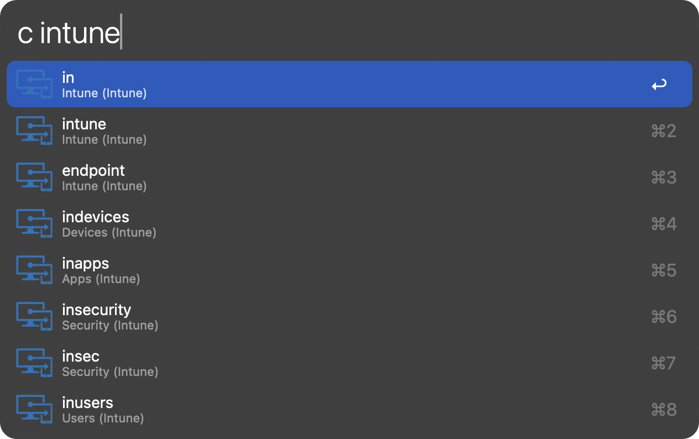
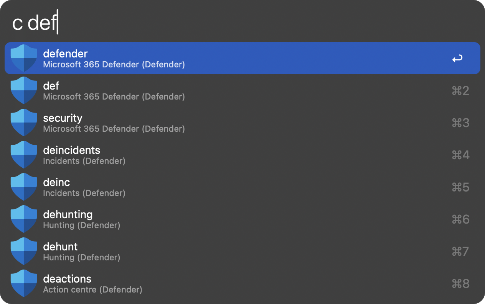

# cmd.ms for Alfred

An Alfred workflow that provides quick access to Microsoft command reference documentation from [cmd.ms](https://cmd.ms).

## Overview

This workflow fetches the latest command reference data from the cmd.ms GitHub repository and presents it in an easy-to-search format within Alfred. Search for commands by name or alias to quickly find documentation links for Microsoft tools and services.

## Features

- Instant search of all commands from the cmd.ms database
- Results grouped by category with appropriate icons
- Support for command aliases
- Hourly cache refresh to ensure up-to-date information
- Lightweight implementation with minimal dependencies

## Example Searches

    
    

## Installation

1. Download the latest release from the [releases page](https://github.com/dannystewart/cmd-ms-alfred/releases/).
2. Double-click the .alfredworkflow file to install.
3. Ensure you have Python 3.6+ installed on your system.
4. The workflow will automatically install the required requests package.

## Usage

1. Trigger the workflow with your chosen keyword (recommended: `cmd`).
2. Start typing to search for commands.
3. Press Enter on a result to open the documentation in your browser.

## Workflow Configuration

### Recommended Settings

- **Keyword**: cmd (with space, argument required)
- **Placeholder Title**: "Search Microsoft Command References"
- **Placeholder Subtext**: "Search for commands from cmd.ms"
- **"Please Wait" Subtext**: "Fetching command reference data..."
- **Match Mode**: "Word starts with" or "All words" (with "Alfred filters results" enabled)

## Credits

- Command reference data provided by [cmd.ms](https://cmd.ms) (Merill Fernando)
- Icons should be placed in an icons directory with filenames matching the lowercase category names

## License

[MIT License](LICENSE)
